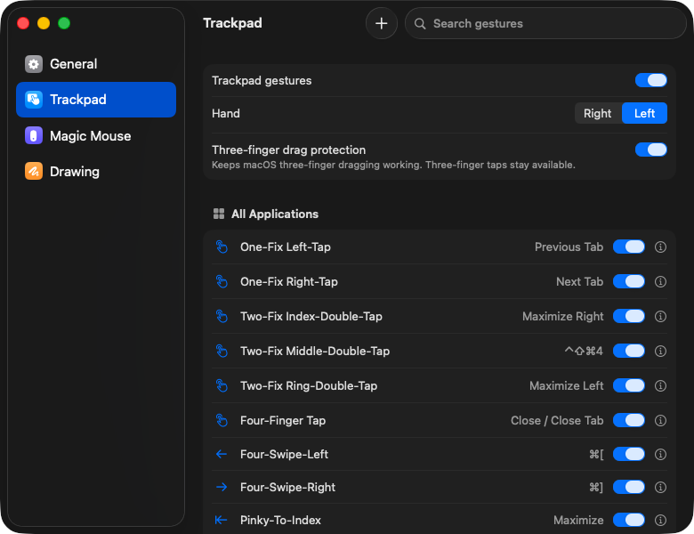
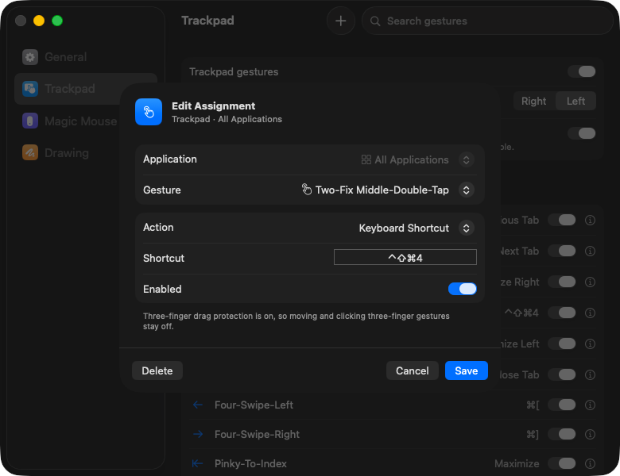

# Jitouch Modern

**Jitouch for Apple Silicon and current macOS.** Extra multi-touch gestures for
your MacBook trackpad, Magic Trackpad and Magic Mouse: switch tabs, close
windows, snap windows left/right, jump between windows, and more.

> **Unofficial community fork.** Based on
> [JitouchApp/Jitouch](https://github.com/JitouchApp/Jitouch), modified by
> [kitjub](https://github.com/kitjub) in 2026. Not endorsed by the original
> authors.



## Why this fork

The original Jitouch's last release was in January 2023, and its issue tracker
has open reports from people whose Jitouch stopped working on Sonoma and Apple
Silicon Macs. This fork keeps Jitouch's gesture engine and your existing
settings, and rebuilds the app around it:

- **Native Apple Silicon app.** One menu-bar app replaces the old Preference
  Pane, so there's nothing to install in System Settings.
- **New settings window** in the style of System Settings, with gestures grouped
  by app, on/off switches, search, and an editor for adding gestures.
- **Previous Window action.** Switches to your most recently used window, like
  Alt-Tab on Windows. It also works between two windows of the same app, such as
  two Chrome windows, which ⌘-Tab can't do.
- **Works alongside macOS three-finger drag.** Optional protection keeps native
  dragging working; three-finger taps stay available.
- **Reliability fixes.** Recovers when macOS disables the event tap, releases
  simulated mouse buttons instead of leaving them stuck, avoids running each
  gesture twice after a restart, and no longer freezes for a second after wake.
- **Your settings carry over.** It reads the same preferences as the original
  Jitouch, so your gestures are already set up.
- **Emergency stop.** Press ⌃⌥⌘⎋ to pause all gestures at any time.

Tested on an M1 Pro MacBook Pro with macOS 26. Built for macOS 13 or later. If
you try it on another Mac, please
[open an issue](https://github.com/kitjub/Jitouch/issues) to say how it went.



## Install

1. Download `Jitouch-Modern-…-arm64.zip` from the
   [latest release](https://github.com/kitjub/Jitouch/releases/latest).
2. Unzip it and drag **Jitouch Modern** into your **Applications** folder.
3. Open it. This build isn't notarized by Apple, so the first time macOS says it
   can't verify the app:
   1. Click **Done**.
   2. Open **System Settings › Privacy & Security**, scroll down, and click
      **Open Anyway** next to *"Jitouch Modern" was blocked*.
   3. Confirm with **Open Anyway** and your password.

   Or run this once in Terminal instead:
   ```sh
   xattr -dr com.apple.quarantine "/Applications/Jitouch Modern.app"
   ```
4. When asked, allow Jitouch Modern in **Accessibility** and **Input
   Monitoring**. Jitouch needs both to read the trackpad and perform actions.
   Then click **Retry** in Jitouch's General settings if gestures aren't active
   yet.
5. In **General**, turn on **Open at login**.

**Coming from the original Jitouch?** Turn it off first (System Settings ›
Jitouch, or remove the Jitouch Preference Pane). If both run at once, every
gesture happens twice.

## Uninstall

Choose **Quit Jitouch Modern** from the menu-bar icon and move the app to the
Trash. Your gesture settings stay in
`~/Library/Preferences/com.jitouch.Jitouch.plist`; delete that file to remove
them as well.

## Build from source

You only need Apple's Command Line Tools (`xcode-select --install`), not Xcode.

```sh
make            # build build/Jitouch Modern.app
make test       # run the unit tests
make install    # install to ~/Applications and open at login
make release    # build the release zip
```

See [BUILDING-CLT.md](BUILDING-CLT.md) and [MODERNIZATION.md](MODERNIZATION.md)
for details.

## Credits and license

Jitouch was created by Supasorn Suwajanakorn and Sukolsak Sakshuwong
([jitouch.com](https://www.jitouch.com/)) and later maintained by Aaron
Kollasch. This fork builds on their work.

Copyright (c) Supasorn Suwajanakorn and Sukolsak Sakshuwong. All rights reserved.
Modified work copyright (c) Aaron Kollasch. All rights reserved.
Modified work copyright (c) 2026 kitjub.

Licensed under the [GNU General Public License v3.0](LICENSE).
